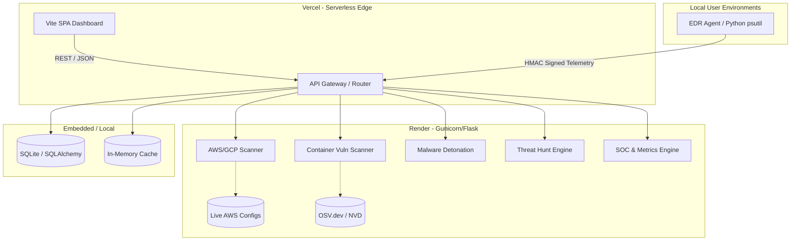

# 🛡️ CloudShield — AI-Augmented Unified Cloud & Container Security Platform

CloudShield is an advanced, production-grade **DevSecOps** platform designed to provide a unified, single-pane-of-glass view for enterprise security. It bridges the gap between local endpoint security and cloud infrastructure by combining real-time **Endpoint Detection & Response (EDR)**, **Cloud Security Posture Management (CSPM)**, **Container Vulnerability Scanning**, and **Advanced Threat Hunting (VQL)** into one seamless ecosystem.

Built with enterprise compliance and modern architectures in mind, CloudShield natively maps all findings to **CIS Benchmarks**, **NIST 800-53**, **ISO 27001**, and **HIPAA**.

---

## 🏗️ Detailed Architecture & Data Flow

CloudShield employs a decoupled, highly scalable architecture with a serverless frontend and a robust Python REST API, supported by embedded databases and high-performance caching layers.



### 🔄 The Data Flow
1. **Endpoint Telemetry:** The local EDR agent (`cloudshield_agent.py`) actively monitors running processes. When an anomaly is detected (e.g., encoded PowerShell execution), it extracts the exact `exe_path` and `cmdline`, signs the payload via HMAC, and pushes it to the Render API.
2. **Threat Hunting:** The API stores these events. When an analyst runs a VQL query from the dashboard, the backend parses the `SELECT * FROM ... WHERE ...` syntax, executes a regex-based keyword extraction, and queries the database to return real-time fleet matches.
3. **Cloud Auditing:** When a CSPM scan is triggered, the backend utilizes `boto3` to securely pull live IAM configurations, S3 ACLs, and EC2 Security Group rules, evaluating them against embedded OPA-style policy rules.

---

## 🛠️ Technology Stack

| Domain | Technologies Used |
|--------|-------------------|
| **Frontend** | Vanilla JS, HTML5, CSS3, Vite, Vercel |
| **Backend API** | Python 3.10+, Flask, Gunicorn, Render |
| **Database/ORM** | SQLite (Production Fallback), SQLAlchemy |
| **Cloud Integration**| `boto3` (AWS API Integration) |
| **Vulnerability DB** | Trivy, OSV.dev Database (National Vulnerability DB) |
| **Endpoint Agent** | Python `psutil`, `requests`, `hmac` |

---

## 🌟 Comprehensive Feature Set

### ☁️ Cloud Security Posture Management (CSPM)
- **Live AWS Auditing:** Dynamically fetches and evaluates real cloud configurations.
- **IAM Policy Analysis:** Detects missing MFA requirements and overly permissive inline policies.
- **S3 / Storage Audit:** Assesses bucket ACLs, encryption status, and public exposure risks.
- **EC2 Security Groups:** Identifies unrestricted ingress rules (e.g., SSH open to `0.0.0.0/0`).

### 🐳 Container Security
- **Trivy / OSV Integration:** Scans Docker and OCI images for known vulnerabilities.
- **CVSS Scoring:** Automatically categorizes vulnerabilities by Critical, High, Medium, and Low severities.

### 🔬 SOC & Advanced Threat Intelligence
- **Threat Hunting (VQL):** Advanced Velociraptor Query Language syntax parser mapping over SQLite. Execute queries like `SELECT * FROM Windows... WHERE CommandLine =~ "Hidden"` across the entire fleet.
- **Attack Dashboard:** Real-time WAF edge block metrics, spoofing origin tracking, and rolling attack rate visualizations.
- **SOC Event Stream:** Live, severity-coded security event log documenting system changes, detections, and automated mitigations.
- **Security Alerts:** Correlated alerts combining agent telemetry and cloud scan results.

### 💻 Endpoint Detection & Response (EDR)
- **Local Agent:** Lightweight, non-intrusive Python agent mapping execution path anomalies.
- **HMAC Authentication:** Cryptographically verified agent-to-backend communication preventing rogue telemetry injection.
- **Fleet Management:** Monitor all connected endpoints with dynamic health scoring.

### ☢️ Malware Sandbox Detonation
- **Hybrid Detonation Engine:** Analyzes suspicious URLs, IPs, and file hashes. 
- **Process Tree Mapping:** Visualizes execution chains (simulated in free-tier environments).
- **IOC Extraction:** Automatic identification of Indicators of Compromise.

---

## 🚀 Deployment & Local Setup

### 1. Live Production URLs
- **Dashboard (Frontend):** [cloudshield-vtah.vercel.app](https://cloudshield-vtah.vercel.app)
- **API (Backend):** [cloudshield-tya3.onrender.com](https://cloudshield-tya3.onrender.com)

*Note: The repository includes a global `vercel.json` and a root `package.json` to properly intercept and route GitHub CI/CD pushes to the `/frontend` directory, preventing build crashes on duplicate Vercel hooks.*

### 2. Local Setup: Backend (Flask API)
```bash
cd backend
pip install -r requirements.txt
python app.py
```
> The API will be available at `http://localhost:5000`

### 3. Local Setup: Frontend (Vite)
```bash
cd frontend
npm install
npm run dev
```
> The Dashboard will be available at `http://localhost:5173`

### 4. Running the EDR Agent
```bash
cd agent
pip install psutil requests
python cloudshield_agent.py
```
> The agent auto-connects to the production backend by default. To point it to a local backend, set the `CLOUDSHIELD_API_URL` environment variable.

---

## 📡 API Reference Guide

| Method | Path | Description |
|--------|------|-------------|
| `POST` | `/api/agent-scan` | Receives HMAC-verified agent telemetry. |
| `POST` | `/api/scan/cloud` | Executes cloud misconfiguration policy scans. |
| `POST` | `/api/scan/container`| Scans container images for vulnerabilities via OSV.dev. |
| `POST` | `/api/hunt` | Executes VQL Threat Hunting queries. |
| `POST` | `/api/analyze/risk` | Processes sandbox detonations. |
| `GET`  | `/api/security-metrics`| Retrieves WAF attack metrics and rolling logs. |
| `GET`  | `/api/soc-timeline` | Retrieves the live SOC event stream. |

---

## 📄 License
This project is licensed under the MIT License — See the [LICENSE](./LICENSE) file for details.
