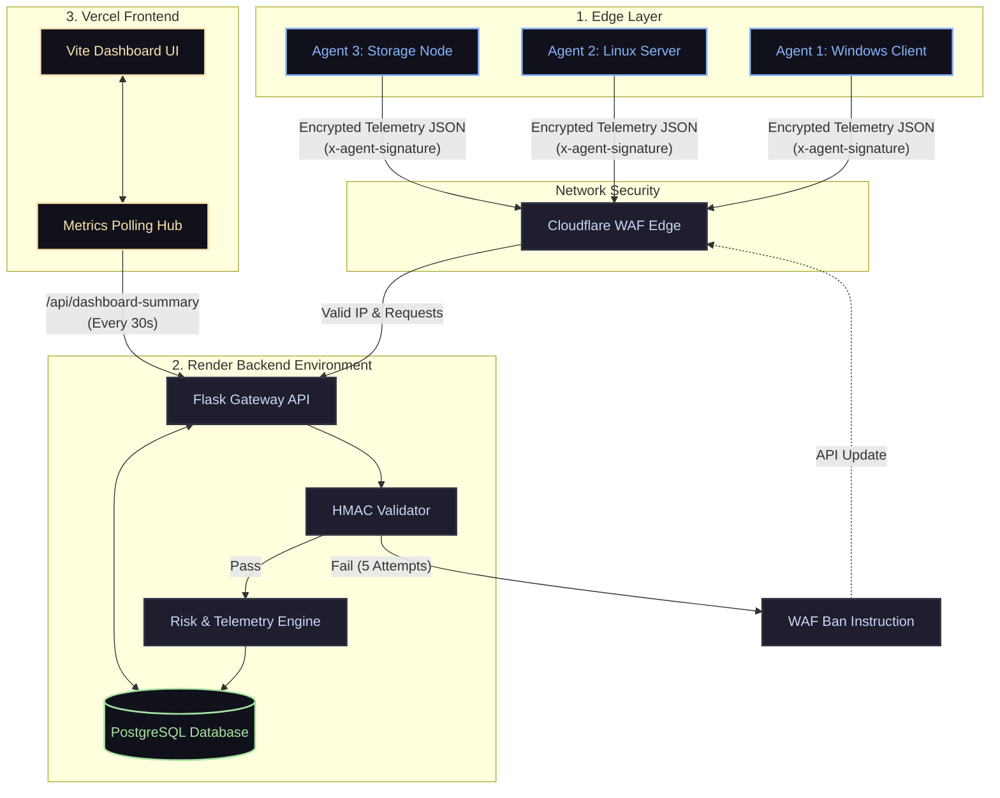

# CloudShield Architecture

CloudShield leverages a distributed Edge-to-Cloud architecture mapping remote system states into an aggregated global risk platform.

## Architecture Diagram

## System Flow

### Remote Endpoint Execution
1. **Agent Execution**: The user launches the standalone `.exe` or `python agent.py` loop. It begins harvesting Trivy CVEs, CPU metrics, and open ports.
2. **Cryptographic Sealing**: The agent uses physical API keys to hash the payload signature. 
3. **Transmission**: The payload transits to `/api/agent-scan` externally over standard HTTPS REST.

### Cloud Receiving & Security Routing
1. **Cloudflare**: Incoming traffic checks WAF policies and stops DoS routing.
2. **Backend Interception**: Flask captures the packet. `handle_failed_auth()` executes via HMAC. Invalid keys > 5 trigger a massive fallback ban via Edge networking API.
3. **Database Sink**: Valid data uses `SQLAlchemy` mapping. `Agent` tables are safely `UPSERT`-ed, capturing immediate state and resetting the `last_seen` timestamp. 

### Web Aggregation
1. **Frontend Hub**: `dashboard.js` loops an infinite poll grabbing `/api/dashboard-summary` safely capturing total global state locally at an interval rate logic handling 429 back-offs manually.
2. **Agent Pruning**: Background Flask threads ensure any Agent breaching more than a 60 second lag falls to "offline". Any dead agent lagging more than 300 seconds is strictly removed out of the system state (`SQLAlchemy Delete`).
