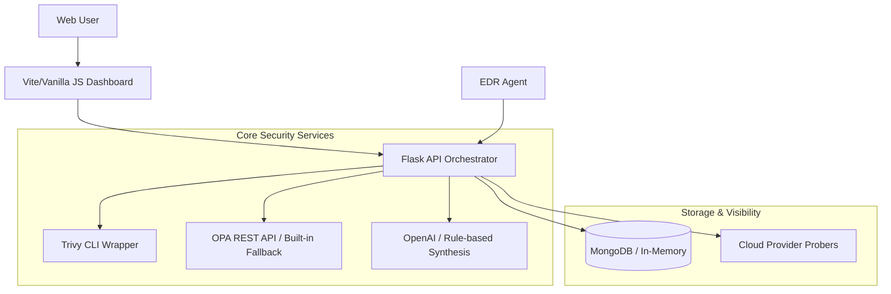

# CloudShield Architecture 🏗️

CloudShield is built on a modular, service-oriented architecture designed for maximum resilience and transparency.

## System Overview

## "Never Falter" Design Principle

A critical feature of CloudShield is its ability to operate under failure conditions without returning HTTP 500 errors.

- **Vulnerability Scanning**: If the `trivy` binary is missing, the system auto-activates a simulated fallback mode to ensure the UI remains interactive.
- **Policy Evaluation**: If the OPA server (`:8181`) is unreachable, a built-in Python rule engine (mirroring the Rego policies) takes over.
- **AI Analysis**: If the OpenAI API key is missing or the service is down, a deterministic narrative engine generates risk summaries from the findings.
- **Persistence**: If MongoDB is unreachable, the system transparently switches to an in-memory storage array.

## Component Breakdown

### 1. Frontend (Dashboard)
- **Technology**: Vanilla JavaScript, Vite, Chart.js.
- **Logic**: Communicates with the Backend API via asynchronous fetch calls. Dynamically adjusts its reporting target (`localhost` vs `production`) based on the environment.

### 2. Backend (Orchestration)
- **Technology**: Flask (Python 3.12+).
- **Responsibility**: Routes external requests, manages the security scan pipeline, and aggregates findings from multiple sources into a unified risk report.

### 3. Service Layer
- **DB Service**: Manages MongoDB interactions and fallback logic.
- **AI Service**: Handles prompt engineering and LLM lifecycle.
- **Trivy/OPA Services**: Interface with security tools and parse raw output into a standard finding schema.

## Data Flow

1. **Trigger**: User inputs an image name or cloud config.
2. **Scan**: Backend invokes the relevant service (Trivy or OPA).
3. **Parse**: Raw findings are normalized into a standard "Finding" object (ID, Title, Severity, Source).
4. **Enrich**: The AI Service provides a natural language risk narrative.
5. **Persist**: Results are saved to MongoDB.
6. **Return**: The UI displays the enriched, aggregated report.
