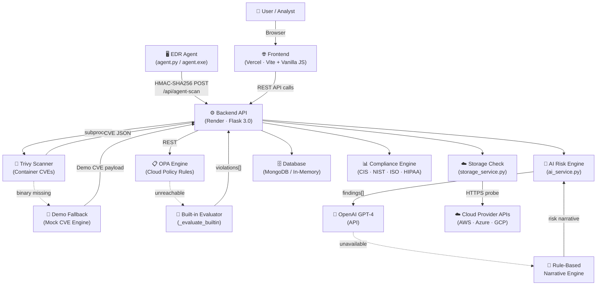

# CloudShield Technical Architecture

> Version 3.0 | Last Updated: April 2026

---

## System Architecture Diagram



---

## Component Descriptions

### 👤 User / Analyst
Security operators interact through the CloudShield SaaS dashboard. No client-side installation required — the entire platform is browser-accessible.

---

### 🌐 Frontend (Vercel)
- **Technology:** Vanilla JavaScript, Vite, Chart.js
- **Hosted:** Vercel (auto-deploys on `git push main`)
- **Responsibilities:**
  - SOC alert board with severity-based cards
  - Real-time risk dial (0–100 score)
  - Fleet dashboard polling `/api/agent-status` every 10 seconds
  - Attack telemetry mini-charts
  - Cloud config scanner UI
  - Storage bucket exposure checker
  - AI risk narrative panel

---

### ⚙️ Backend API (Render)
- **Technology:** Python 3.12, Flask 3.0, Gunicorn
- **Hosted:** Render Web Service (auto-deploys on `git push main`)
- **Core Endpoints:**

| Method | Path | Description |
|--------|------|-------------|
| POST | `/api/scan/container` | Container CVE scan (Trivy / fallback) |
| POST | `/api/scan/cloud` | Cloud config policy evaluation (OPA / fallback) |
| POST | `/api/storage/check` | Multi-cloud bucket public exposure check |
| POST | `/api/analyze/risk` | AI risk narrative synthesis |
| POST | `/api/report/unified` | Full compound report (all scanners + AI) |
| POST | `/api/agent-scan` | HMAC-signed EDR telemetry receiver |
| GET  | `/api/agent-status` | Fleet health dashboard |
| GET  | `/api/security-metrics` | Aggregated attack metrics |
| GET  | `/api/soc-timeline` | SOC event stream |
| GET  | `/api/risk/score` | Global 0–100 infrastructure risk score |
| GET  | `/api/download-agent` | Serve pre-compiled EDR agent binary |

---

### 🖥️ EDR Agent
- **Technology:** Python + psutil + PyInstaller
- **Distribution:** Downloadable `.exe` from dashboard
- **Telemetry collected:** CPU %, RAM %, listening ports, top processes, Trivy CVEs (cached 20 min)
- **Security:** HMAC-SHA256 signed payloads, anti-replay nonce cache (120s TTL)
- **Loop interval:** 30s (backed off to 60s when CPU > 80%)

---

### 🐳 Trivy Scanner
- **Role:** Container filesystem and image CVE analysis
- **Invocation:** `subprocess.run(["trivy", "image", ...])`
- **Fallback:** If binary is absent (PAAS environments), a structured mock-CVE payload (`_demo_mode: True`) is returned. The downstream pipeline — risk scoring, AI synthesis, compliance mapping — runs identically against both real and mock data.

---

### 📋 OPA Engine + Built-in Evaluator
- **Role:** Cloud configuration policy enforcement
- **Primary:** OPA (Open Policy Agent) REST API evaluating Rego policies
- **Fallback:** `_evaluate_builtin()` — a deterministic Python evaluator implementing identical rule logic without any external dependency
- **Detects:** Public S3, unencrypted S3, IAM `*:*` wildcards, open SSH/HTTP ports, missing MFA

---

### ☁️ Storage Check Engine
- **Role:** Live HTTPS exposure probing for cloud storage buckets
- **Providers:** AWS S3, Azure Blob, GCP Cloud Storage
- **Demo mode:** Known-public buckets return an instant `public: true` response for reliable demonstrations
- **Resilience:** `ConnectionError`, `Timeout`, and all other exceptions map to `public: false` with a structured safe-state response

---

### 🧠 AI Risk Engine
- **Role:** Synthesizes multi-source findings into executive risk narratives
- **Primary:** OpenAI GPT-4 (when `OPENAI_API_KEY` is set)
- **Fallback:** Rule-based narrative generator using severity counts and finding types — produces structured summaries with zero external dependency

---

### 🗄️ Database
- **Primary:** MongoDB (when `MONGODB_URI` is set) — persists scan results, SOC events, agent telemetry
- **Fallback:** In-memory Python arrays — fully functional for demo and single-session use

---

### ☁️ Cloud Provider APIs
Used by the storage check engine and the AWS live scanner (`/api/scan/aws`):
- **AWS:** boto3 (`s3`, `ec2`, `iam` clients)
- **Azure:** `azure-storage-blob` SDK
- **GCP:** `google-cloud-storage` SDK

---

## Security Architecture

```
┌──────────────────────────────────────────────────────────────────┐
│                     SECURITY PERIMETER                            │
│                                                                   │
│  ┌─────────────┐    ┌─────────────────┐    ┌─────────────────┐  │
│  │  CORS Layer │    │  Rate Limiter   │    │  HMAC Verifier  │  │
│  │             │    │                 │    │                 │  │
│  │ Strict      │    │ 20 req/min per  │    │ SHA-256 sign.   │  │
│  │ origin      │    │ IP (Flask-      │    │ + nonce check   │  │
│  │ allowlist   │    │ Limiter)        │    │ + timestamp ±60s│  │
│  └─────────────┘    └─────────────────┘    └─────────────────┘  │
│                                                                   │
│  ┌─────────────┐    ┌─────────────────┐                         │
│  │ Input Valid.│    │ Payload Limit   │                         │
│  │             │    │                 │                         │
│  │ Regex check │    │ 512KB max body  │                         │
│  │ on all IDs  │    │ before HMAC     │                         │
│  └─────────────┘    └─────────────────┘                         │
└──────────────────────────────────────────────────────────────────┘
```

---

## Deployment Model

```
Developer Machine
      │
      │  git push origin main
      ▼
GitHub Repository
      │
      ├──────────────────────────────────────┐
      │                                      │
      ▼                                      ▼
Render Web Service                    Vercel Project
(backend/)                            (frontend/)
      │                                      │
      │  gunicorn wsgi:app                   │  npm run build (Vite)
      │                                      │
      ▼                                      ▼
https://cloudshield-tya3.onrender.com  https://cloudshield-vtah.vercel.app
```
